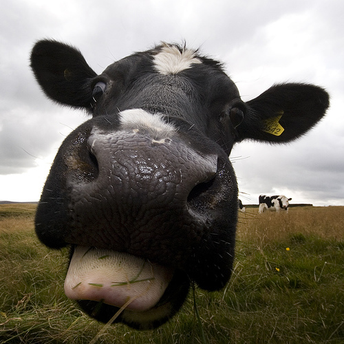

# cattleCNV

# Cattle Copy Number Variation

FISH results for the paper "*Individualized cattle copy number and segmental duplication maps using next generation sequencing*" can be viewed [here](FISH_results_51.md)

[Bos Taurus Karyotype](Karyotype.md)

The paper "*Analysis of copy number variations among diverse cattle breeds*" can be viewed at [Genome Research](http://genome.cshlp.org/content/early/2010/03/05/gr.105403.110.abstract):

## Analysis of copy number variations among diverse cattle breeds

George E. Liu, Yali Hou, Bin Zhu, Maria Francesca Cardone, Lu Jiang, Angelo Cellamare, Apratim Mitra, Leeson J. Alexander, Luiz L. Coutinho, Maria Elena Dell'Aquila, Lou C. Gasbarre, Gianni Lacalandra, Robert W. Li, Lakshmi K. Matukumalli, Dan Nonneman, Luciana C. de A. Regitano, Tim P.L. Smith, Jiuzhou Song, Tad S. Sonstegard, Curt P. Van Tassell, Mario Ventura, Evan E. Eichler, Tara G. McDaneld and John W. Keele

## Abstract

Genomic structural variation is an important and abundant source of genetic and phenotypic variation. Here we describe the first systematic and genome-wide analysis of copy number variations (CNVs) in modern domesticated cattle using array comparative genomic hybridization (array CGH), quantitative PCR (qPCR) and fluorescent in situ hybridization (FISH). The array CGH panel included 90 animals from 11 Bos taurus, 3 Bos indicus and 3 composite breeds for beef, dairy or dual purpose. We identified over 200 candidate CNV regions (CNVRs) in total, and 177 within known chromosomes, which harbor or are adjacent to gains or losses. These 177 high-confidence CNVRs cover 28.1 mega bases or, ~1.07% of the genome. Over 50% of the CNVRs (89/177) were found in multiple animals or breeds and analysis revealed breed-specific frequency differences and reflected aspects of the known ancestry of these cattle breeds. Selected CNVs were further validated by independent methods using qPCR and FISH. Approximately 67% of the CNVRs (119/177) completely or partially span cattle genes and 61% of the CNVRs (108/177) directly overlap with segmental duplications. The CNVRs span about 400 annotated cattle genes that are significantly enriched for specific biological functions such as immunity, lactation, reproduction and rumination. Gene families including ULBP have gone through ruminant lineage-specific gene amplification, we detected and confirmed marked differences in CNV frequencies across diverse breeds, indicating that some cattle CNVs are likely to arise independently in breeds and contribute to breed differences. Our results provide a valuable resource beyond microsatellites and single nucleotide polymorphisms to explore the full dimension of genetic variability for future cattle genomic research.

[Supplemental materials](http://genome.cshlp.org/content/early/2010/03/05/gr.105403.110/suppl/DC1)

[FISH results](FISH_results_51.md)
